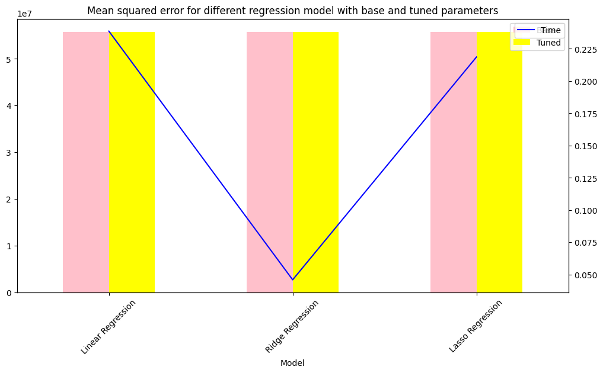

Link to Python notebook - https://github.com/timeless81/Module-11---Used-Cars/blob/main/prompt_II.ipynb

# Module-11---Used-Cars

## Business Understanding
1. The key drivers for used car prices may include the following 
2. The model, make and year of the car
3. The mileage of the car etc.

From the given dataset our goal is to identify the factors which determin the used car price. There are so many parameters at play here but not all those parameters are detrimental to decide the price of the car. We need to understand the data and reduce the principal components and come up with a feature set which is most impactful. Model the problem on the reduced feature set using various ML techniques like LinearRegression, LogisticRegression etc. to determine prices of a used car based on it's features.

## Data Understanding

After considering the business understanding, we want to get familiar with our data.  Write down some steps that you would take to get to know the dataset and identify any quality issues within.  Take time to get to know the dataset and explore what information it contains and how this could be used to inform your business understanding.

## Data Preparation

### Following are the steps involved in the data processing
#### Clean the data, remove all the null data fields
#### Remove the columns which are not going to make any impact to the car price e.g. VIN and id
#### Remove all the rows where price is 0

## Modeling

Following are the steps invovled in modeling
1. Do the data encoding of the non numerical columns.
2. Split the train and test data.
3. Fit various linear regression models like "linear regression", "ridge" and "lasso" regression.
4. Calculate the mean_squared_error of these models on the test data.

## Evaluation 
Following steps are involved
1. Try out different regression models like Ridge and Lasso and check if the mse improves.
2. Use GridSearchCV to calculate the best parameters for the regression models
3. Re-run the modeling using the best parameters found using GridSearchCV
4. Here are the results from evaluation - 

## Deployment
Based on our analysis following are the top features determining the price of a used car
top 4 features are - 
['condition_new', 'fuel_electric', 'transmission_manual', 'type_convertible']

